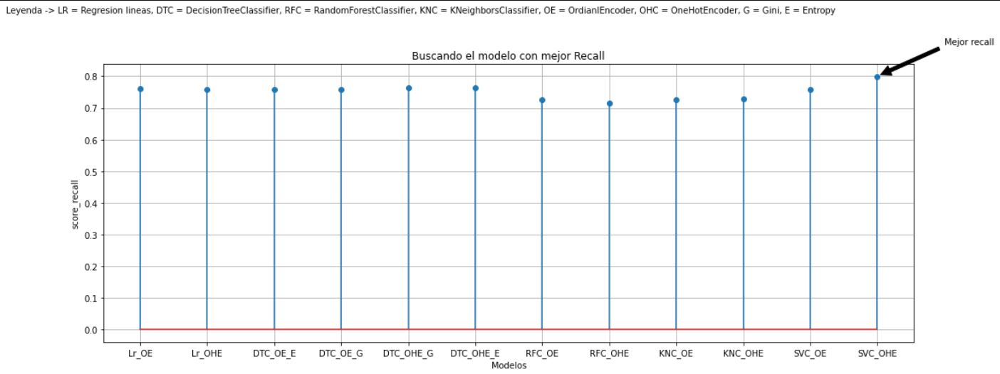

# Datathon-Huarcaya Tacas Edward

# Descripcion de directorios
1. **Data:** Encontramos el E-commerce test y train
2. **img:** Imagenes para el .md
3. **ML:** Se encuentra el notboock de EDA y Modelamiento

# Descripcion del primer avance
Por le momento voy usando el modelo de **Regresion logistica** y de **arboles de decision**, todos estan plasmados en la carpeta ML dentro del notBock **Modelamiento**. En el notBock **EDA** estan las visualizaciones y evaluaciones acerca de los datos faltantes o nulos.
El calculo de la prediccion se da en el mismo notBock **Modelamiento** en la parte final.

# Descripcion del segundo avance:
Aplique los modelos de arboles de decision, bosques aleatorios, KNNeighbor y SVM. **Ajustando el modelo de arbol de decision mejoro el recall**

# Descripcion del tercer avance:
Usando **Pipelin** logro mejorar el recall en el modelo **SVC**

# Resultado final

Vemos que el mejor modelo es SVC

